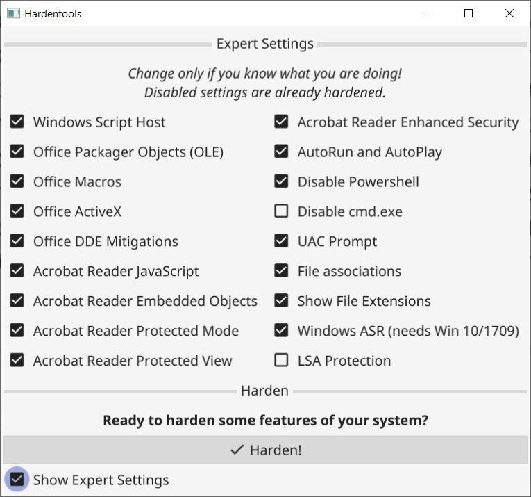

# Hardentools

Hardentools is a collection of simple utilities designed to disable a number of "features" exposed by operating systems (Microsoft Windows, for now), and primary consumer applications. These features, commonly thought for enterprise customers, are generally useless to regular users and rather pose as dangers as they are very commonly abused by attackers to execute malicious code on a victim's computer. The intent of this tool is to simply reduce the attack surface by disabling the low-hanging fruit. **Hardentools is intended for individuals at risk, who might want an extra level of security at the price of *some* usability**. It is not intended for corporate environments.

> **WARNING**: This tool disables a number of features, including of Microsoft Office, Adobe Reader, and Windows, that might cause malfunctions to certain applications. You can find a complete list of changes [here](https://github.com/securitywithoutborders/hardentools/wiki). Use this at your own risk.

Bear in mind, after running Hardentools you won't be able, for example, to do complex calculations with Microsoft Office Excel or use the Command-line terminal, but those are pretty much the only considerable "downsides" of having a slightly safer Windows environment. Before deciding to use it, make sure you read this document thoroughly and understand that yes, something might break. In case you experience malfunctions as a result of the modifications implemented by this tool, please do let us know.

When you're ready, you can find the latest download [here](https://github.com/securitywithoutborders/hardentools/releases).

## What Hardentools IS NOT

- **Hardentools is NOT an Antivirus**. It does not protect your computer. It doesn't identify, block, or remove any malware.
- It does NOT prevent software from being exploited.
- It does NOT prevent the abuse of every available risky feature.
- It does NOT prevent the changes it implements from being reverted. If malicious code runs on the system and it is able to restore them, the premise of the tool is defeated.

## How to use it

Once you double-click on the icon, depending on your Windows privileges, you are asked if you want to run Hardentools with administrative privileges. If you select "No" only a subset of the harden features is available, but you can also use hardentools if you have only restricted privileges to harden your user account. If you select "Yes", depending on your Windows security settings, you should be prompted with an User Access Control dialog asking you confirmation to allow Hardentools to run. Click "Yes".

Then, you will see the main Hardentools window. It's very simple, you just click on the "Harden" button, and the tool will make the changes to your Windows configuration to disable a set of features that are risky. Once completed, you will be asked to restart your computer for all the changes to have full effect.

Note: You can select the expert settings checkbox to be able to select or deselect specific harden measures. Please only use this if you know what you are doing.

In case you wish to restore the original settings and revert the changes Hardentools made (for example, if you need to use cmd.exe), you can simply re-run the tool and instead of an "Harden" button you will be prompted with a "Harden again (all default settings)" and a "Restore..." button. Selecting "Restore" will start reverting the modifications. "Harden again" will first restore the original settings and then harden again using the default settings. This comes in handy if you have started a newer version of hardentools and you want to make sure the most current features are applied to your user.

**Please note**: the modifications made by Hardentools are exclusively contextual to the Windows user account used to run the tool from. In case you want Hardentools to change settings for other Windows users as well, you will have to run it from each one of them logged in.

## Credits

This tool is developed by Claudio Guarnieri, Mariano Graziano and Florian Probst. You can find [here](https://github.com/securitywithoutborders/hardentools/graphs/contributors) a full list of contributors.

Hammer icon by Travis Avery from the Noun Project.
