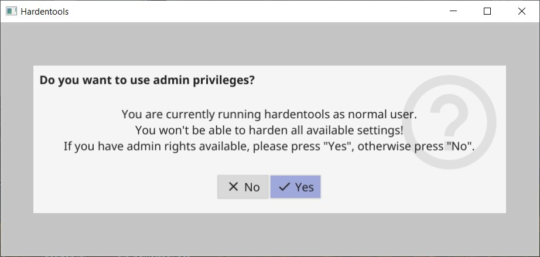
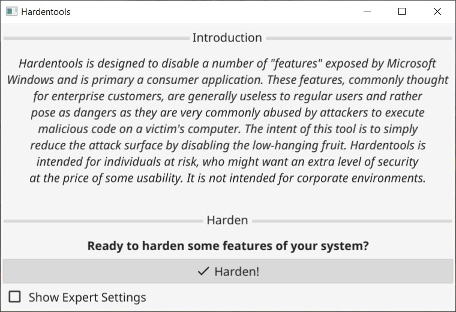
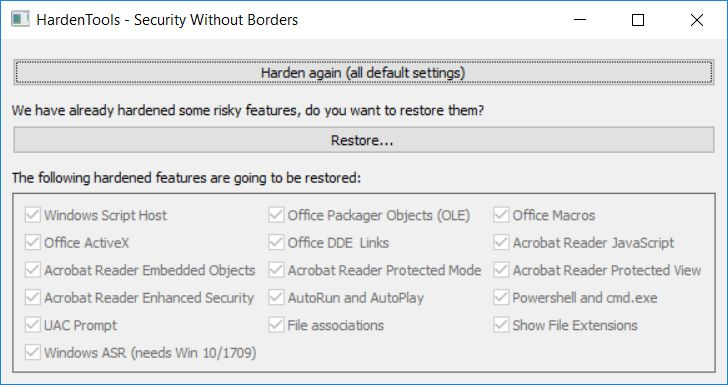

# Hardentools

Hardentools is a collection of simple utilities designed to disable a number of "features" exposed by operating systems (Microsoft Windows, for now), and primary consumer applications. These features, commonly thought for enterprise customers, are generally useless to regular users and rather pose as dangers as they are very commonly abused by attackers to execute malicious code on a victim's computer. The intent of this tool is to simply reduce the attack surface by disabling the low-hanging fruit. **Hardentools is intended for individuals at risk, who might want an extra level of security at the price of *some* usability**. It is not intended for corporate environments.

> **WARNING**: This is just an experiment, it is not meant for public distribution yet. Also, this tool disables a number of features, including of Microsoft Office, Adobe Reader, and Windows, that might cause malfunctions to certain applications. Use this at your own risk.

Bear in mind, after running Hardentools you won't be able, for example, to do complex calculations with Microsoft Office Excel or use the Command-line terminal, but those are pretty much the only considerable "downsides" of having a slightly safer Windows environment. Before deciding to use it, make sure you read this document thoroughly and understand that yes, something might break. In case you experience malfunctions as a result of the modifications implemented by this tool, please do let us know.

When you're ready, you can find the latest download [here](https://github.com/securitywithoutborders/hardentools/releases).

## How to use it

Once you double-click on the icon, depending on your Windows privileges, you are asked if you want to run Hardentools with administrative privileges. If you select "No" only a subset of the harden features is available, but you can also use hardentools if you have only restricted privileges to harden your user account. If you select "Yes", depending on your Windows security settings, you should be prompted with an User Access Control dialog asking you confirmation to allow Hardentools to run. Click "Yes".

Then, you will see the main Hardentools window. It's very simple, you just click on the "Harden" button, and the tool will make the changes to your Windows configuration to disable a set of features that are risky. Once completed, you will be asked to restart your computer for all the changes to have full effect.

Note: The selections in the expert settings part of the window allow you to select or deselect harden measures. Please only use these if you know what you are doing.

In case you wish to restore the original settings and revert the changes Hardentools made (for example, if you need to use cmd.exe), you can simply re-run the tool and instead of an "Harden" button you will be prompted with a "Harden again (all default settings)" and a "Restore..." button. Selecting "Restore" will start reverting the modifications. "Harden again" will first restore the original settings and then harden again using the default settings. This comes in handy if you have startet a newer version of hardentools and you want to make sure the most current features are applied to your user.

**Please note**: the modifications made by Hardentools are exclusively contextual to the Windows user account used to run the tool from. In case you want Hardentools to change settings for other Windows users as well, you will have to run it from each one of them logged in.

## What this tool IS NOT

- It does NOT prevent software from being exploited.
- It does NOT prevent the abuse of every available risky feature.
- **It is NOT an Antivirus**. It does not protect your computer. It doesn't identify, block, or remove any malware.
- It does NOT prevent the changes it implements from being reverted. If malicious code runs on the system and it is able to restore them, the premise of the tool is defeated, isn't it?

## Disabled Features

### Generic Windows Features

- **Disable Windows Script Host**. Windows Script Host allows the execution of VBScript and Javascript files on Windows operating systems. This is very commonly used by regular malware (such as ransomware) as well as targeted malware.

- **Disabling AutoRun and AutoPlay**. Disables AutoRun / AutoPlay for all devices. This prevents applicatons from automatically executing when you plug a USB stick into your computer.

- **Disables powershell.exe and powershell_ise.exe execution via Windows Explorer**. This prevents the use of PowerShell by malicious code trying to infect the system. You will not be able to open PowerShell directly anymore. 

- **Disables cmd.exe execution via Windows Explorer (optional)**. You will not be able to use the cmd terminal and it should prevent malicious code trying to infect the system by using cmd.exe to e.g. start powershell.exe. This setting is optional because cmd.exe is used quite often by users and applications. This must therefore be enabled manually in the expert settings sections.

- **Sets User Account Control (UAC) to always ask for permission** (even on configuration changes only) and to use "secure desktop".

- **Disable file extensions mainly used for malicious purposes**. Disables the ".hta", ".js", ".JSE", ".WSH", ".WSF", ".scf", ".scr", ".vbs", ".vbe" and ".pif" file extensions for the current user (and for system wide defaults, which is only relevant for newly created users).

- **Shows file extensions and hidden files in explorer**. This is very useful to detect files pretending to be another file type (e.g. an exe file named like iAmSimulatingToBeAPdf.pdf.exe)

- **Windows Defender Attack Surface Reduction (ASR)**. Enables various remediations using ASR starting with Windows 10 / 1709 (Block executable content from email client and webmail, Block Office applications from creating child processes, Block Office applications from creating executable content & from injecting code into other processes, Block JavaScript or VBScript from launching downloaded executable content, Block execution of potentially obfuscated scripts, Block Win32 API calls from Office macro). To be effective this needs the following prerequisites:

  - Windows 10 version >= 1709,
  - You are using Windows Defender Antivirus as the sole antivirus protection app,
  - Real-time protection is enabled in Windows Defender.

### Microsoft Office

- **Disable Macros**. Macros are at times used by Microsoft Office users to script and automate certain activities, especially calculations with Microsoft Excel. However, macros are currently a security plague, and they are widely used as a vehicle for compromise. With Hardentools, macros are disabled and the "Enable this Content" notification is disabled too, to prevent users from being tricked.

- **Disable OLE object execution**. Microsoft Office applications are able to embed so called "OLE objects" and execute them, at times also automatically (for example through PowerPoint animations). Windows executables, such as spyware, can also be embedded and executed as an object. This is also a security disaster which we observed used time and time again, particularly in attacks against activists in repressed regions. Hardentools entirely disables this functionality.

- **Disabling ActiveX**. Disables ActiveX Controls for all Office applications. ActiveX controls can provide additional functionality in documents and are mostly used in enterprise environments. The impact of this setting is that ActiveX controls do not initialize and you are not notified that the ActiveX controls are disabled. Note: This doesn't disable ActiveX in Internet Explorer.

- **Disable DDE and Excel Links**. Disables DDE for Word, Excel and Outlook. The DDE protocol allows to send messages between applications to share data. This is an attack vector if the user opens a malicious document. Side effects are:

  - If there are links to other office documents (to update data in a excel sheet for instance) this data is not updated automatically anymory. If you are using such kinds of documents you might have to disable this harden setting.

  - Every Excel document is opened in a separate Excel instance if opened using Windows explorer. This might also have impact on sharing data between the documents and consume more memory.

### Acrobat Reader

- **Disable JavaScript in PDF documents**. Acrobat Reader allows to execute JavaScript code from within PDF documents. This is widely abused for exploitation and malicious activity.

- **Disable execution of objects embedded in PDF documents**. Acrobat Reader also allows to execute embedded objects by opening them. This would normally raise a security alert, but given that legitimate uses of this are rare and limited, Hardentools disables this.

- **Switch on the Protected Mode**. When protected mode is enabled, Acrobat Reader assumes all PDFs are potentially malicious and confines any processing they invoke to a sandbox so that malicious PDF files can't infect the computer. (This setting is enabled by default in current Acrobat Reader versions.)

- **Switch on Protected View** for all files from untrusted sources. In the Protected View mode, most features are disabled to prevent malicious PDF files to do harm. You can view the PDF, but not do much else. A yellow bar displays on top of the Reader window. Click Enable All Features to exit the Protected View. but do that with caution and only for files you are really sure to originate from a trusted source.  

- **Switch on Enhanced Security**. This setting disallows PDF files to fetch data from untrusted locations. (This setting is enabled by default in current Acrobat Reader versions.)

## Authors

This tool is developed by Claudio Guarnieri, Mariano Graziano and Florian Probst.

## Credits

Hammer icon by Travis Avery from the Noun Project
